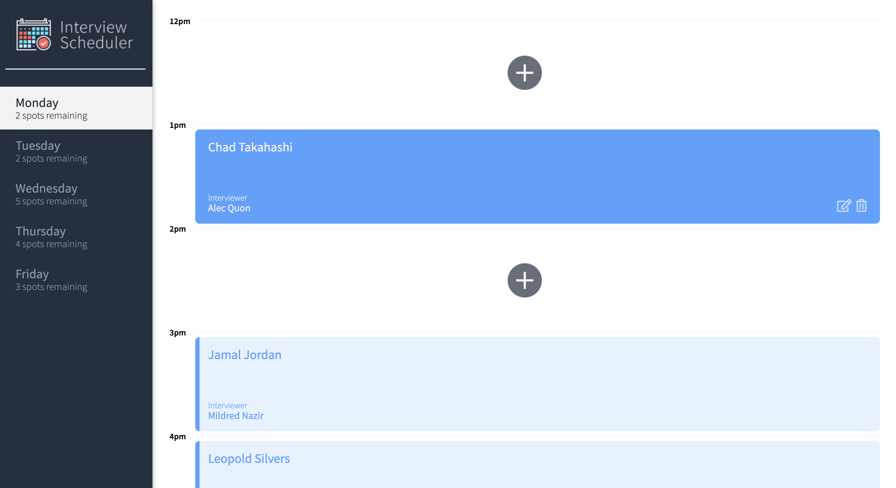
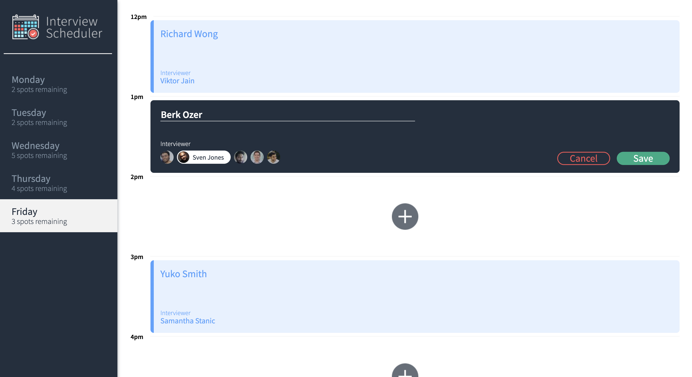
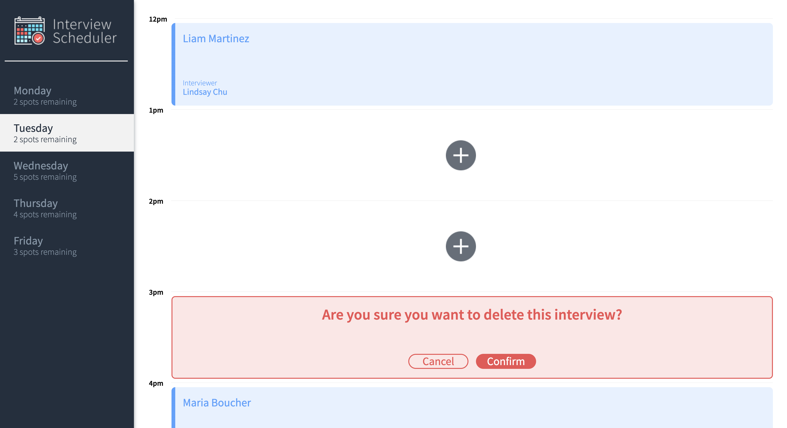

# Interview Scheduler

Find it hard to keep track of all the interviews you conduct at your company?

Try Interview Scheduler! Built with modern React, Interview Scheduler helps you stay on top of all the appointments.

Book, edit, and cancel interviews as you like. Keep track of the scheduled appointments easier than ever before.

## Final Product

## Technology

Single-page application built with modern React practices such as hooks and functional components.

This app uses HTML, SCSS, JS and React on the front-end; and  Node, Express and PostgreSQL on the back-end.

## Dependencies

- React 16.9.0 or above
- Axios
- Classnames
- Node.js
- Express
- Node-postgres

## How To Use Interview Scheduler

#### Book an Interview

Click on any available spot, enter the name of the interviewee and select an interviewer.
  
If no spots are available, you can choose a different day on the left sidebar.

#### Edit an Interview

Something changed? No problem.

Simply hover over an appointment, click the edit button, do the changes, and hit save.

#### Delete an Interview

Hover over an appointment and click the delete button. 

Now you got an open spot in your schedule! May I recommend an hour in the spa?

## Getting Started

1. Install all dependencies (using the `npm install` command).
2. Download and install [scheduler-api](https://github.com/berk-ozer/scheduler-api) following the instructions on its repo.
3. Start the API server while in the "scheduler-api" directory using the `npm start`.
4. Start the Webpack development server while in the "scheduler" directory using `npm start`. The app will be served at <http://localhost:8000/>. Enjoy!

## Coming Soon

Deploying the app on Heroku so you can get on it more easily!

